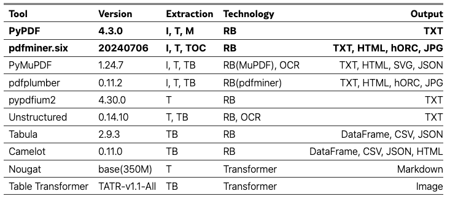

### PDF解析格式转换工具

- common tools
    - PyPDF
    - pdfminer
    - PyMuPDF/PyMuPDF4LLM

- https://huggingface.co/spaces/huggingchat/pdf-to-markdown
    - pypdf
    - ocrmypdf
- https://github.com/johnlinp/pdf-to-markdown
    - pdfminer

- https://github.com/VikParuchuri/marker
    - transformer
> table提取比较好，但是图片提取比较粗糙
- https://github.com/opendatalab/MinerU
    - transformer
    - pymupdf
> table提取默认是图片，图片提取比较精细

比较指标
- 文本提取
- 图片识别
- 表格识别

### 额外的benchmark
- https://huggingface.co/datasets/upstage/dp-bench
